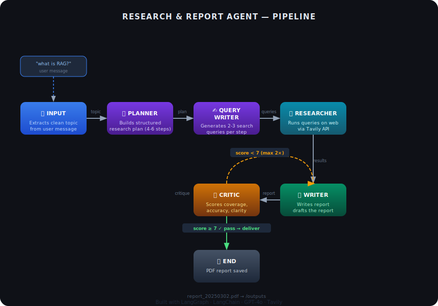

# research-and-report-agent

An autonomous multi-agent pipeline that takes a natural language question, researches it on the web, and produces a structured, reviewed PDF report — all without human intervention.

## How It Works

The pipeline is built with **LangGraph** and consists of six agents chained together. Each agent reads from a shared state object and writes its output back into it, passing structured data to the next stage.

### Agents

**Input Agent** — Takes the raw user message (e.g. *"what's new with RAG?"*) and uses the LLM to extract a clean, well-formed research topic. Handles typos, casual phrasing, and vague questions.

**Planner** — Produces a structured research plan with 4–6 steps. Each step has a title, description, and goal. Writing/synthesis steps are explicitly forbidden — the plan covers research only.

**Query Writer** — For each step in the plan, generates 2–3 targeted web search queries. Queries are varied in angle (factual, recent, comparative) to maximise search coverage.

**Researcher** — Executes every query against the **Tavily** search API using `search_depth="advanced"`. Collects up to 3 sources per query, storing title, URL, and content snippet for each result.

**Writer** — Consumes all research results and writes a structured report capped at **1100 words (~2 A4 pages)**. On revision runs, the Critic's feedback is injected at the top of the prompt so the Writer knows exactly what to fix.

**Critic** — Reviews the finished report against the original plan and raw research data. Scores four dimensions independently:

| Dimension | Weight | What it checks |
|---|---|---|
| Coverage | 40% | Every research step has a matching section |
| Accuracy | 40% | All facts are grounded in the research data |
| Clarity | 20% | Well-structured, easy to follow |

If the overall score is **≥ 7**, the report is delivered. If not, it is sent back to the Writer with specific issues and revision instructions. Maximum **2 revision attempts**.